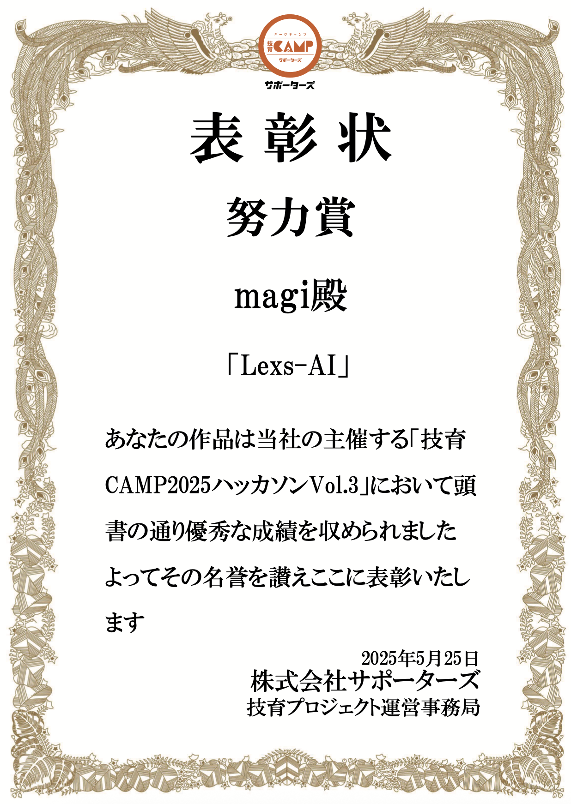

# Lexs-AI
Lexs-AI は、英単語の学習をサポートする革新的な英語学習Webアプリ。
単語の意味を覚えるだけでなく、その単語を使った自然な英文をAIが自動生成し、実践的な理解を深めることができる。

**サービスURL** : https://word-quiz-yc0i.onrender.com
※ユーザ-名とパスワードの登録が必要

**動作紹介ムービー**\

## 参加メンバー:チーム[magi]
小西隆一 : Ryuichi-K-create\
小森紀輝 : morixxfoxdata\
岩田卓也 : TakuyaIW\
伊藤結人 : Kindaiyuito

## 主な機能
🎮 <ins>4択クイズ形式のテスト機能<ins>\
-実践的なクイズで知識をチェック。正解数・不正解数のカウントも対応。

📊 <ins>出題のパーソナライズ<ins>\
-間違えた単語を記録し、出題頻度を自動調整。効率的に弱点を克服。

🧠 <ins>単語から英文を自動生成<ins>\
-学習中の単語を使った自然な英文をAIが生成。文脈ごとの理解が深まる。

📚 <ins>単語帳モード<ins>\
-自分専用の単語リストを作成・編集可能。復習に最適。

📈 <ins>学習ダッシュボード機能<ins>\
-学習履歴・学習進捗・正答率を可視化。

## 🛠 使用技術（Tech Stack）
| Category            | Technology Stack                                          |
|---------------------|-----------------------------------------------------------|
| Frontend            | HTML, CSS, JavaScript                                     |
| Backend             | Python, Flask                                             |
| Infrastructure      | Render (Hosting & Server)                                 |
| Database            | PostgreSQL                                                |
| API Integration     | Gemini API                                                |
| CI/CD               | GitHub Actions  　　　　　　　　　　　　                      |

## 🏆 受賞歴
### 技育CAMP2025　ハッカソン vol.3 - 努力賞受賞
