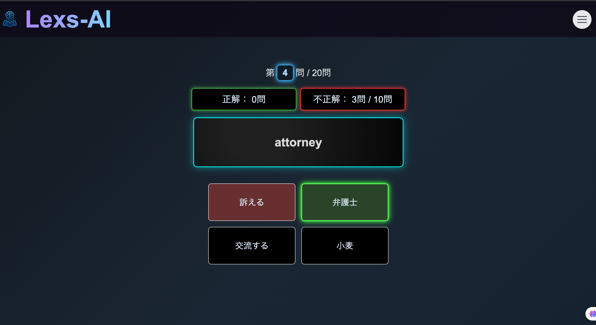
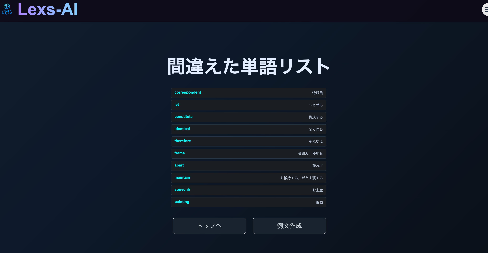
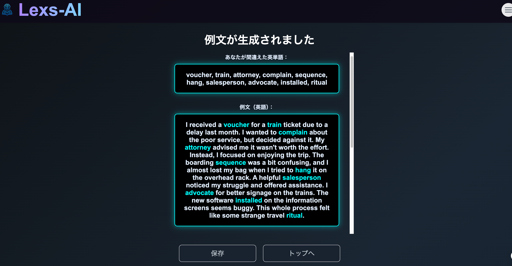
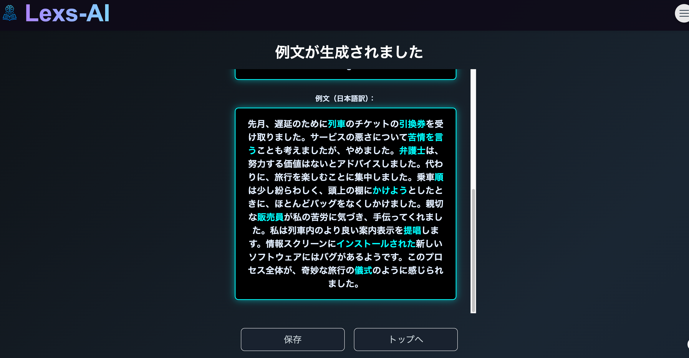
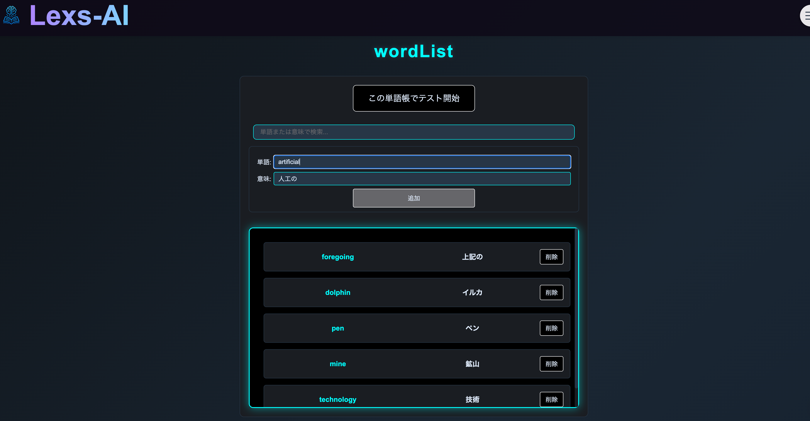
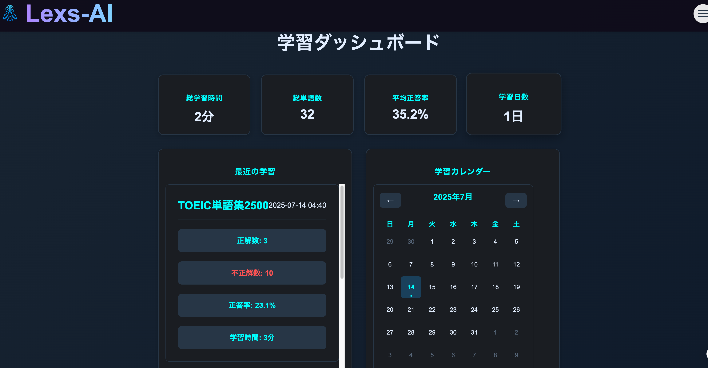
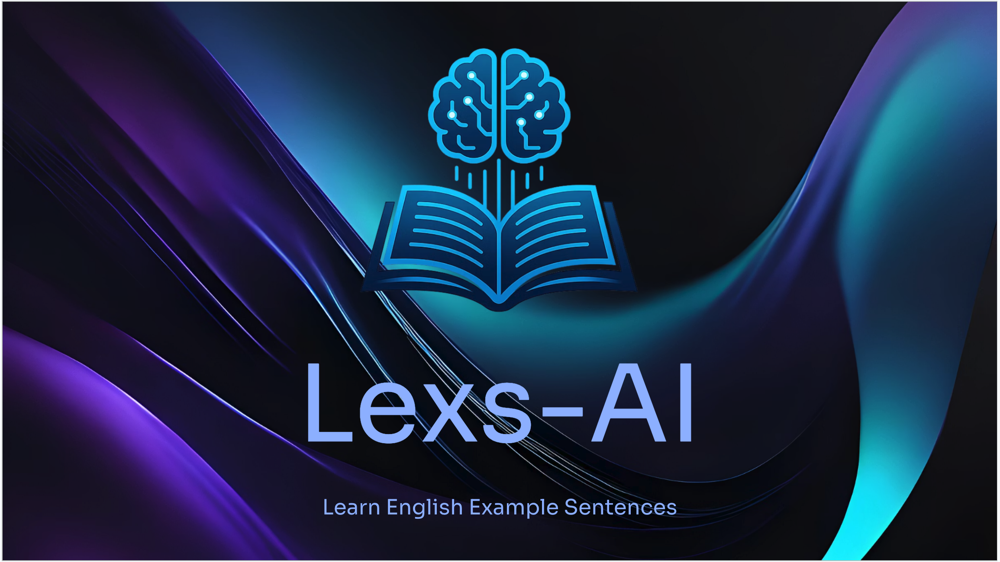
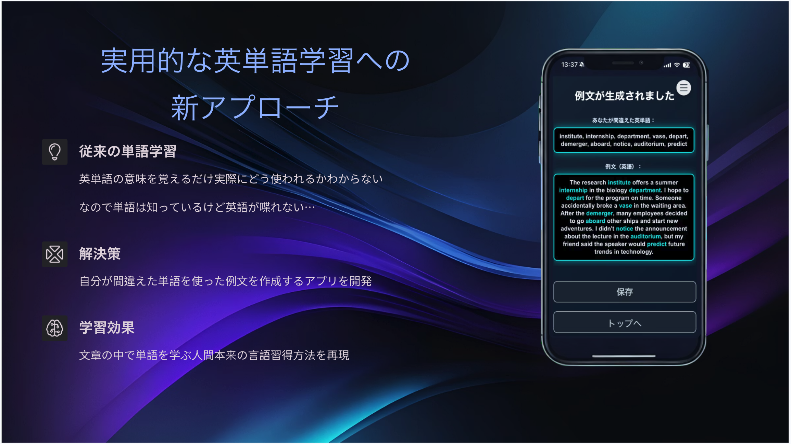
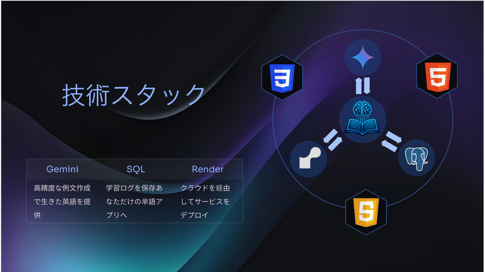
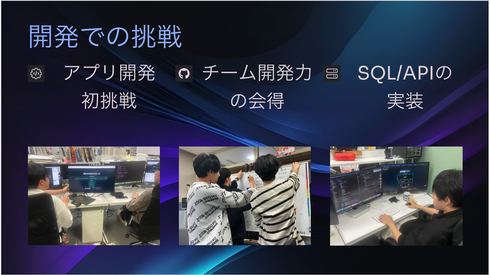

# Lexs-AI
Lexs-AI は、英単語の学習をサポートする革新的な英語学習Webアプリ。
単語の意味を覚えるだけでなく、その単語を使った自然な英文をAIが自動生成し、実践的な理解を深めることができる。

**サービスURL** : https://word-quiz-yc0i.onrender.com
※ユーザ-名とパスワードの登録が必要

**動作紹介ムービー**\

## 参加メンバー:チーム[magi]
- 小西隆一 : [Ryuichi-K-create](https://github.com/Ryuichi-K-create)  
- 小森紀輝 : [morixxfoxdata](https://github.com/morixxfoxdata)  
- 岩田卓也 : [TakuyaIW](https://github.com/TakuyaIW)  
- 伊藤結人 : [Kindaiyuito](https://github.com/Kindaiyuito)

## 開発背景
TOEICなどの英語試験対策に取り組む中で、従来の英単語学習アプリには限界があると感じた。多くのアプリは、単語とその意味を暗記させることに重点を置いている。しかし、それだけでは実際の使用例が把握できず、学習した内容が記憶に定着しにくいという課題がある。

この問題に対し、単語の意味だけでなく、その単語が使われる文脈や用法を例文として提示することで、より深い理解と定着が得られるのではないかと考えた。

そこで本アプリでは、テストで間違えた英単語をもとに適切な例文を自動生成し、単語学習と同時にその活用方法を習得できる仕組みを実現した。

英語を効率的かつ本質的に学びたい学習者にとって、本サービスは有効な学習ツールである。学習内容の記憶定着を促進するだけでなく、文脈理解を深める点においても価値があると考えている。

## 主な機能
### 🎮 4択クイズ形式のテスト機能
-実践的なクイズで知識をチェック。正解数・不正解数のカウントも対応。

  

### 📊 出題のパーソナライズ
-間違えた単語を記録し、出題頻度を自動調整。効率的に弱点を克服。

  

### 🧠 単語から英文を自動生成
-学習中の単語を使った自然な英文をAIが生成。文脈ごとの理解が深まる。

  
  

### 📚 単語帳モード
-自分専用の単語リストを作成・編集可能。復習に最適。

  

### 📈 学習ダッシュボード機能
-学習履歴・学習進捗・正答率を可視化。

  

## 🛠 使用技術（Tech Stack）
| Category            | Technology Stack                                          |
|---------------------|-----------------------------------------------------------|
| Frontend            | HTML, CSS, JavaScript                                     |
| Backend             | Python, Flask                                             |
| Infrastructure      | Render (Hosting & Server)                                 |
| Database            | PostgreSQL                                                |
| API Integration     | Gemini API                                                |
| CI/CD               | GitHub Actions  　　　　　　　　　　　　                      |

## 🏆 受賞歴
### 技育CAMP2025　ハッカソン vol.3 - 努力賞受賞

  

### 発表スライド

  

  

  

  

